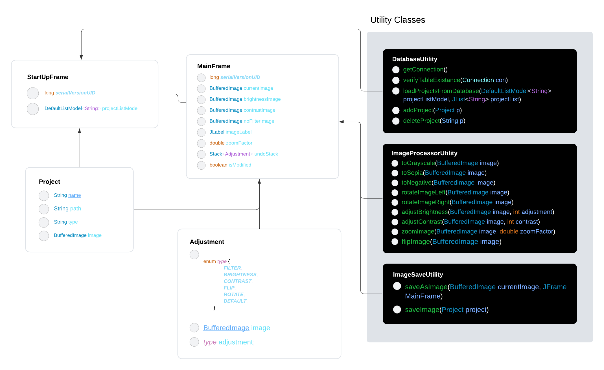

# Photo filter application
### Andrei Grad

## Descriere
A photo filter/editing application in Java that gives the user basic and advanced editing features and adjustment settings,
supporting different image file formats as .png, .jpg and .jpeg.
Focused on simplicity, the application has an user-friendly UI and it's great for simple projects.
The app features a GUI developed with Swing for a modern and user focused look.

## Obiective
Here is a list of things that the application should support:

* Import images of different format types;
* Save the changes and export them as a different file;
* Adjust images with filters and simple editing techniques;
* Undo functionality for managing mistakes.

## Arhitectura

As in the map below, the application is structured in a StartUpframe and a MainFrame.
It also uses utility classes to manage static methods.

## Functionalitati/Exemple utilizare

Here is a list of things that the application supports:

* Import images of different format types;
* Save the changes and export them as a different file;
* Apply the next modifications:
    - Rotations;
    - Zoom;
    - Flip image;
    - Apply filters;
    - Adjust brightness;
    - Adjust contrast;
* Undo functionality for managing mistakes.

### Resurse
Code Ranch, [Online] Available: https://coderanch.com/ ;

StackOverflow, [Online] Available: https://stackoverflow.com/ ;

Medium, [Online] Available: https://aryamansharda.medium.com/understanding-image-contrast-algorithms-8636723a0f05#:~:text=Contrast%20is%20really%20just%20a,maximum%20and%20minimum%20pixel%20intensities/ ;

Reddit, [Online] Available: https://www.reddit.com/ ;

JavaTPoint, [Online] Available: https://www.javatpoint.com/java-swing ;